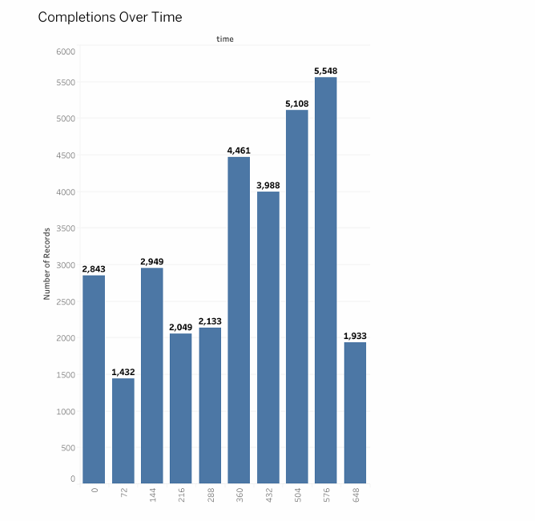

# Customer Campaign Performance Analysis

Analyzing the effectiveness of marketing campaigns using customer demographics, transaction history, and offer engagement data.

---

## 🔍 Project Overview
This project investigates **which campaign offers drive the highest engagement and revenue** across different customer segments.  
By combining transaction, demographic, and campaign data, we identify **actionable recommendations** for optimizing marketing campaigns.

---

## 📂 Datasets
- `events.csv` – customer actions (transactions, offers received/viewed/completed)  
- `offers.csv` – metadata (offer type, duration, reward, difficulty)  
- `customers.csv` – demographics (age, gender, income, membership date)  
---

## 🛠️ Tools & Methods
- **Python (pandas, matplotlib, seaborn, numpy)** – data cleaning & analysis  
- **Excel** – quick cleaning & validation  
- **Tableau** – visualization  

**Data Cleaning**  
- Removed ~2,000 invalid customers (e.g., unrealistic ages, missing income/gender)  
- Merged events, offers, and customers datasets into one analysis-ready file  

**Analysis Focus**  
- Offer completion rates (Discount vs. BOGO)  
- Customer segmentation by age, income, gender  
- Engagement trends over campaign timeline  
- Spending behavior across income groups  

---

## 📈 Key Insights

### 1. Discount vs. BOGO Offers
Discount offers significantly **outperformed BOGO offers** in completion rates.  

---

### 2. Segment Engagement (Age & Income)
Customers aged **30–44 with €50K–€100K income** completed the most offers.  

---

### 3. Spending by Income Group
High-income customers (>€100K) spent **5× more per transaction** than lower-income groups.  

---

### 4. Campaign Timing
Engagement peaked between **Days 15–24** and dropped sharply afterward.  

---

## 🎯 Recommendations
- Prioritize **discount offers** as the main promotional type  
- Target **30–44 age group with €50K–€100K income** for maximum ROI  
- Develop **premium offers** tailored to high-income customers (>€100K)  
-

